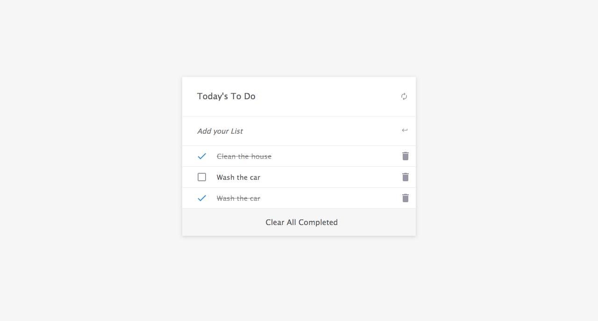

# Project Name

## To do List

> This project contains the HTML, CSS and JavaScript. This is a milestone project for microverse by Ezema Anthony Sunday.

# WORK FLOW SCREEN

## SCREEN SHOT

## Live Demo

[Click Here to view live version](https://kaylemba.github.io/Todo-list/dist/)

## Built With

### Major languages

- HTML
- CSS
- Javascript

### Technologies used

- Github
- Git
- Visual Studio Code

## Getting Started

\*Instructions on how to access my project locally.\*\*
To Access my project locally please follow the following instructions;

1. Enter this url: https://github.com/sonyco-4u/To-do-list-list-structure/ in your web browser.
2. Once opened navigate to the top left level of the project a green code download button will be visible on the righthand side.
3. Select download Zip option from drop down menu.
4. Once the download is complete you will be able to access my project locally.
   Here is my repository link: https://github.com/sonyco-4u/To-do-list-list-structure/

## Author

👤 Ezema Anthony Sunday

- GitHub: [@sonyco-4u](https://github.com/sonyco-4u)
- Twitter: [@EZEMASUN](https://twitter.com/EZEMASUN)
- LinkedIn: [ezema-anthony-sunday](https://www.linkedin.com/in/ezema-anthony-sunday-9180a3157)

## 🤝 Contributing

Contributions, issues, and feature requests are welcome!

Feel free to check the issues page.

## Acknowledgments

## Show your support

Give a ⭐️ if you like this project!

📝 License
This project is MIT licensed.
